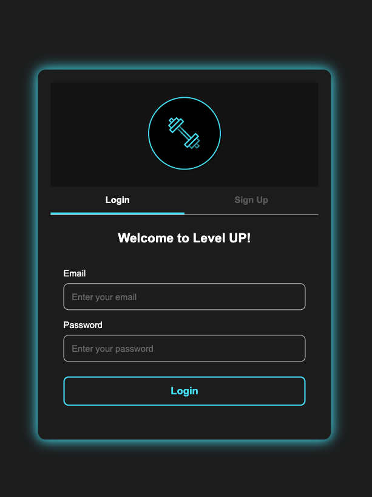

# Level Up - Fitness App

Level Up is a dynamic fitness application that helps users choose workout classes based on their intensity preferences. Whether you’re a beginner or an experienced athlete, Level Up allows users to find and book the perfect classes tailored to their fitness needs. The app is built using modern web technologies and follows industry best practices.



## Features:

- **Class Selection**: Choose classes based on intensity (Easy, Medium, High & Extreme).
- **User Authentication**: Sign up and log in securely using JWT (JSON Web Tokens).
- **Class Booking**: Book, view, and manage your fitness classes.
- **Responsive UI**: Fully responsive design for mobile and desktop users.
- **Polished User Experience**: Clean, intuitive interface for easy navigation.

## Technologies Used:

- **Backend**: Node.js, Express.js, PostgreSQL, Sequelize ORM, JWT Authentication
- **Frontend**: React, TypeScript, Vite
- **Deployment**: Render
- **Database**: PostgreSQL

## API Endpoints:

The backend API provides both **GET** and **POST** routes for retrieving and adding data, utilizing **two server-side APIs** for additional functionality.


## Authentication:

JWT (JSON Web Tokens) is used for secure authentication. Users log in, and a token is issued. 

## Environment Variables:

Sensitive information, like database credentials and API keys, is securely stored in environment variables.

Example:
```
DATABASE_URL=your_database_url
JWT_SECRET=your_jwt_secret 
```
## Folder Structure:

The project follows the separation of concerns principle. The backend and frontend are organized into distinct folders, with clear responsibility separation.
```
.
├── README.md
├── client
│   ├── dist
│   ├── eslint.config.js
│   ├── images
│   ├── index.html
│   ├── node_modules
│   ├── package-lock.json
│   ├── package.json
│   ├── src
│   │   ├── App.css
│   │   ├── App.tsx
│   │   ├── api
│   │   ├── assets
│   │   ├── components
│   │   ├── declarations.d.ts
│   │   ├── index.css
│   │   ├── main.tsx
│   │   ├── pages
│   │   ├── styles
│   │   └── vite-env.d.ts
│   ├── tsconfig.app.json
│   ├── tsconfig.json
│   ├── tsconfig.node.json
│   └── vite.config.ts
└── server
    ├── dist
    ├── insert_data.sql
    ├── node_modules
    ├── nodemon.json
    ├── package-lock.json
    ├── package.json
    ├── schema.sql
    ├── src
    │   ├── config
    │   ├── controllers
    │   ├── middleware
    │   ├── models
    │   ├── routes
    │   ├── seeds
    │   ├── server.ts
    │   └── utils
    └── tsconfig.json
```

# Getting Started:

## Prerequisites:

-Node.js

-PostgreSQL

-Vite

-JWT Authentication

## Installation:

1.Clone the repository:
```
git clone https://github.com/yourusername/level-up.git
cd level-up
```
2.Install dependencies:
```
cd server
npm install
cd ../client
npm install
```
3.Set up environment variables in ```.env ``` files for both frontend and backend.

4.Start the backend server:
```
cd server
npm start
```
5.Start the frontend:

```
cd client
npm run dev
```
6. Open http://localhost:3000 in your browser to access the app.

## Deployment:

The app is deployed on Render, providing a production environment where both the backend API and PostgreSQL database are hosted.

Live App URL: [(https://level-up-wdjr.onrender.com/login)

## Collaboration:

The project was developed collaboratively, with contributions from all group members. There are no major disparities in GitHub contributions, and tasks were shared equally among the team.

## Contributing:

If you would like to contribute, feel free to fork the repository and submit a pull request. Please follow the project’s coding standards and provide tests for new features or bug fixes.

## License:

This project is licensed under the MIT License - see the LICENSE file for details.
